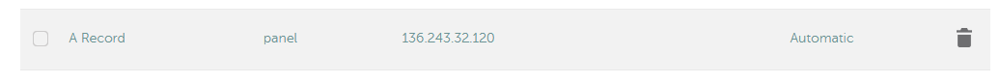
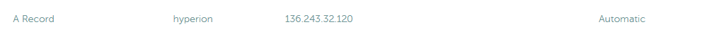
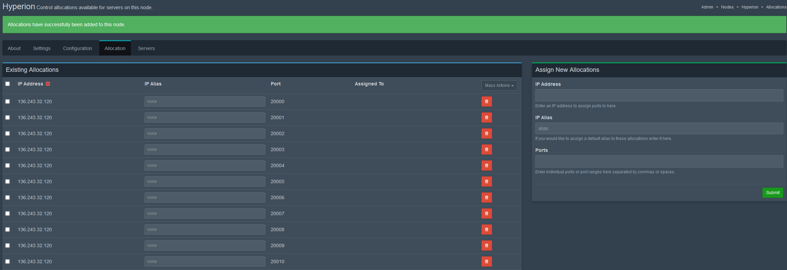
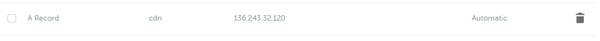

# Durk’s Ultimate Guide to Hosting Level 5 Space Station 14 Servers Using Pterodactyl (without losing your mind in the proccess)

## Introduction
So, like me, you’ve decided to deploy your entire infrastructure in containers using a game server panel and a bunch of questionable workarounds. Well, you’re in luck! My predecessor, Aves Maximus, and I have already done the hard work for you. All you need to do is follow this (somewhat) simple guide, where I’ll walk you through:

- **Installing Pterodactyl Wings and Panel**
- **Configuring multiple nodes**
- **Installing eggs for**:
    - PostgreSQL
    - Prometheus & Grafana
    - SS14.Admin
    - CDN
    - Game servers
    - RMC’s Patreon bot
    - Redbot with OOC relays
    - WikiJS
- **NGINX configs for reverse proxying**
- **Setting up replays**
- **DNS Configuration**

## Requirements
You will need:
- **Basic Linux CLI knowledge** -- You can copy and paste everything in this guide, but experience helps.
- **A SSH Client** -- I recommend [MobaXterm](https://mobaxterm.mobatek.net/) for Windows.
- **A Dedicated Server** -- Recommended: [Hetzner](https://www.hetzner.com/) (EU) or [H4Y](https://www.h4y.us/) (US). A VPS works, but high player counts will bottleneck on single-core performance.  
- **Linux Operating System** -- Preferably **Ubuntu 24.04 LTS**, as this guide assumes you’re using it.
- **A Domain Name** -- I’ll be using [Namecheap](https://www.namecheap.com/), but any registrar (e.g., Cloudflare) works.
- **A dedicated IP**  -- Required for proper networking and SSL. There are workarounds for dynamic and shared IPs, but I will not be going through them in this guide.
- A few hours, a cup of coffee, and a pack of cigarettes.

## Additional Guides & Documentation
- [**Hetzner Robot, Rescue & Installation**](https://www.youtube.com/watch?v=t0oKhTS0MIA)
- [**Namecheap Domain Registration**](https://www.youtube.com/watch?v=a2Jh00ZXYrc)
- [**Pterodactyl Getting Started**](https://pterodactyl.io/panel/1.0/getting_started.html)
- [**Wiki.js Documentation**](https://docs.requarks.io/)

***The following guides will most likely be inaccurate as they do not pertain to hosting with Pterodactyl, you may still find them useful for general debugging.***
- [**SS14 Server Hosting**](https://docs.spacestation14.com/en/general-development/setup/server-hosting-tutorial.html?highlight=level%205#level-5-big-production-server)
- [**SS14.Admin Setup**](https://docs.spacestation14.com/en/server-hosting/setting-up-ss14-admin.html)
- [**SS14.Changelog Setup**](https://docs.spacestation14.com/en/server-hosting/setting-up-ss14-changelog.html) -- We use Delta-V's Changelog Webhook, I will make a guide for this in the future but currently you will have to figure it out yourself.
- [**Robust.CDN Setup**](https://docs.spacestation14.com/en/server-hosting/setting-up-robust-cdn.html)
- [**Replays Setup**](https://docs.spacestation14.com/en/server-hosting/server-replay-recording.html)
- [**Redbot Setup**](https://docs.spacestation14.com/en/server-hosting/setting-up-redbot.htm)


## Basic Ubuntu Setup 
I recommend doing the following steps after you first install Ubuntu:
Run the following commands to update everything:
```bash
sudo apt-get update
sudo apt-get upgrade
sudo apt-get dist-upgrade
```
Then
 - [Create a non-root user](https://hostadvice.com/how-to/web-hosting/ubuntu/how-to-create-a-non-root-user-on-ubuntu-18-04-server/)
 - [Setup SSH Keys and disable password based SSH authentaction](https://www.digitalocean.com/community/tutorials/how-to-set-up-ssh-keys-on-ubuntu-20-04)

Alias trash to rm, this will stop you from doing stupid shit and permenantly deleting files from your server on accident.
```bash
sudo apt install trash-cli
echo "alias rm='trash-put'" >> ~/.bashrc 
source ~/.bashrc
```
I also recommend disabling UFW using 
```bash
sudo ufw disable
```
 as it will ***constantly*** try to get in the way.

## Installing Wings & Pterodactyl Panel
You must be **logged in as root** for this section.

Run
```bash
bash <(curl -s https://pterodactyl-installer.se)
```
to start the installer. 
Enter 2 to install both wings and the panel.
You will be prompted to enter the `database name`, `database username` and `database password`. You can hit enter for each of these options to skip through them, the install script will handle all this for you.

Next you'll be prompted to set a timezone, you can find a list of all options @ https://www.php.net/manual/en/timezones.america.php.
I'll be using `America/Chicago`.

You will then enter an email for your SSL Certificates, I recommend a business email if you have one, i'll be using `goobstation14@gmail.com`.
You will then setup your admistrator account for the panel, you should use your normal email, fill out the username and password with whatever you like but **write it down**, you will need this to access the panel.

You will now set the FQDN of your panel, for example `panel.goobstation.com`. From here you will need to add an A DNS record to your domain directed at your server's ip, which will look something like this:

*DNS records can take a while to populate, if you just entered them give it a few minutes before continuing.*

You'll be asked a few questions afterwards, you should answer with the following:
```bash
* Do you want to automatically configure UFW (firewall)? (y/N): N
* Do you want to automatically configure HTTPS using Lets Encrypt? (y/N): y
* I agree that this HTTPS request is performed (y/N): y
* Initial configuration completed. Continue with installation? (y/N): Y
* Enable sending anonymous telemetry data? (yes/no) [yes]: yes

- - - - - - - - - - - - - - - - - - - - - - - - - - - - - - - - - - - - - - - -
Please read the Terms of Service at
https://letsencrypt.org/documents/LE-SA-v1.4-April-3-2024.pdf. You must agree in
order to register with the ACME server. Do you agree?
- - - - - - - - - - - - - - - - - - - - - - - - - - - - - - - - - - - - - - - -
(Y)es/(N)o: Y

* Installation of panel completed. Do you want to proceed to wings installation? (y/N): Y
* Do you want to automatically configure UFW (firewall)? (y/N): N
* Do you want to automatically configure a user for database hosts? (y/N): N
* Do you want to automatically configure HTTPS using Lets Encrypt? (y/N): Y

* Set the FQDN to use for Let's Encrypt (node.example.com):
```
For the final question you will enter the domain name you want to use for the node, I'll be using `hyperion.goobstation.com`. You'll have to setup another A DNS record for this as well, same as shown before.


More questions to answer:
```bash
* Do you want to automatically configure UFW (firewall)? (y/N): N
* Do you want to automatically configure a user for database hosts? (y/N): N
* I agree that this HTTPS request is performed (y/N): y

* Enter email address for Let's Encrypt: youremail@email.com
* Proceed with installation? (y/N): y
```
Installation is complete! You should be able to view the panel at `panel.yourdomain.com` now! You won't be able to deploy any servers yet, but you are close!

## Configuring Wings
Login to your panel, in the top right you should now see a gear icon, click this to enter the admin section.
From here you'll have to add a location, hit locations on the left side, create new, and enter a short code for your location. This can be anything, I'll set mine to `eu.germany`.

Now head to the Nodes section, click create new. Here you'll have to enter some information,

**Name**: Whatever you want, mine will be Hyperion.
**Description**: Whatever you want once again, or nothing.
**Node Visiblity**: Public
**FQDN**: You set this up a moment ago while installing wings, make sure you use the same link.
**Communicate Over SSL**: Use SSL Connection
**Behind Proxy**: Not Behind Proxy

This next section will depend on your server setup, I won't be running anything outside of pterodactly, so I'll give most of my resources to wings, make sure to leave a little head room for other services in the background.

**Daemon Server File Directory**: /var/lib/pterodactyl/volumes
**Total Memory**: System Memory minus 2-4 GB
**Memory Over-Allocation**: 0
**Total Disk Space**: System Total Disk Space minus ~20 GB
**Disk Over-Allocation**: 0
**Daemon Port**: 8080
**Daemon SFTP Port**: 2022

Now click create node in the bottom right, and it should pop you into the next page. Click `Configuration` at the top, and copy all the text, it should appear to be something like this:
```
debug: false
uuid: *************
token_id: *************
token: *************
api:
  host: 0.0.0.0
  port: 8080
  ssl:
    enabled: true
    cert: /etc/letsencrypt/live/hyperion.goobstation.com/fullchain.pem
    key: /etc/letsencrypt/live/hyperion.goobstation.com/privkey.pem
  upload_limit: 100
system:
  data: /var/lib/pterodactyl/volumes
  sftp:
    bind_port: 2022
allowed_mounts: []
remote: 'https://panel.goobstation.com'
```
Head back to your server's terminal and enter the following command:
```bash
nano /etc/pterodactyl/config.yml
```
Paste the contents of your clipboard and hit Ctrl+X and then Y to save and exit. Now run:
```bash
systemctl start wings
```
You can go back to the main nodes tab in the panel and you should see a green heart next to the node.
Next you'll have to allocate some ports for your eggs, re-enter the node and hit `Allocation`.
In `IP Address` enter the IP for your node, and give it a few ports in `Ports`, I usually use ports in the range of `20000-30000`. Hit sumbit, and you allocations should look a little something like this:


Congrats! You're now ready to start installing eggs.

## Nginx Initial Setup
Run
```bash
nano /etc/nginx/proxy_params
```
and paste
```
proxy_set_header Host $http_host;
proxy_set_header X-Real-IP $remote_addr;
proxy_set_header X-Forwarded-For $proxy_add_x_forwarded_for;
proxy_set_header X-Forwarded-Proto $scheme;
```
hit Ctrl+X and Y to save and exit, then run
```bash
mkdir /etc/nginx/sites-available/containers
```

## Installing Eggs
From within the admin section on the panel, head to `Nests` on the bottom left, click create new, and enter a name.
Now head back to the main nests page, click import egg, set the associated nest to goob, and select your egg file.
You will have to do this several times for each egg, all of the eggs we will be using can be found here: https://github.com/Goob-Station/Eggs

## Setting up Robust.CDN
Head to the Servers tab in the admin panel, click `Create New` enter the following information

**Server Name**: SS14 CDN
**Server Owner**: Enter the name for you admin account, it should autofill
**Start Server when Installed**: False
**Default Allocation**: Choose whatever port you'd like
**Memory**: 0 (I recommend watching this overtime, figure out what it sticks around and set it a little above that)
**Disk Space**: 0 (same as above)
**Nest**: Your Nest
**Egg**: SS14 Cdn

Hit create server.

Head to your domain registar, create a new A record, fill it like before but with the CDN, and wait a few minutes.


In your terminal run
```bash
nano /etc/nginx/sites-available/containers/cdn.conf
```
Enter the following config, make sure to edit `server_name` and `proxy_pass`
```
server {
    listen 80;

    server_name cdn.yourdomain.com;

    location / {
        proxy_pass http://your_ip:port;

        proxy_http_version 1.1;
        proxy_set_header Upgrade $http_upgrade;
        proxy_set_header Connection "upgrade";

        include /etc/nginx/proxy_params;

        client_max_body_size 512m;
    }
}
```
then run
```bash
ln -s /etc/nginx/sites-available/containers/cdn.conf /etc/nginx/sites-enabled/
sudo certbot --nginx -d cdn.yourdomain.com
systemctl reload nginx
```
Head to your normal ptero panel, hit the CDN server, go to files, and open the `appsettings.json`
Here is a basic config, make sure to modify values to match your server. UpdateToken is like a password, make it unique and complex and **do NOT give it out**.
```
{
  "Logging": {
    "LogLevel": {
      "Default": "Information",
      "Microsoft.AspNetCore": "Warning",
      "Robust": "Information"
    }
  },

  "Manifest": {
    "FileDiskPath": "/home/container/builds",
    "DatabaseFileName": "/home/container/manifest.db",

    "Forks": {
      "MyCoolFork": {
        "UpdateToken": "*************",
        "PruneBuildsDays": 90,
        "DisplayName": "My Cool Fork",
        "BuildsPageLink": "https://myforkswebsite.com",
        "BuildsPageLinkText": "My Fork's Cool Website"
      }
    }
  },

  "Cdn": {
    "DatabaseFileName": "/home/container/content.db",
    "StreamCompressLevel": 5,
    "MyCoolFork": "GoobLRP"
  },

  "BaseUrl": "https://cdn.yourdomain.com/",
  "PathBase": "/",
  "AllowedHosts": "*",
  "Urls": "http://0.0.0.0:your_port/",
}
```

From here you'll have to headover to your forks github, go to `/Tools/publish_multi_request.py` and modify the following values:
```py
#
# CONFIGURATION PARAMETERS
# Forks should change these to publish to their own infrastructure.
#
ROBUST_CDN_URL = "https://cdn.yourdomain.com/"
FORK_ID = "MyCoolFork"
```
Now head to the settings of the repository, hit `Secrets and variables`, `Actions`, and `New repository secret`.
Enter `PUBLISH_TOKEN` for the `Name`, and the value you set for `UpdateToken` in the previous config for the `Secret`, and then hit `Add secret`.

Navigate to the Actions tab of your repo, hit `Publish`, and then and `Run workflow`. This will take around 10 minutes to complete.
Finally head over to your CDN's page for the fork, (ex: https://cdn.goobstation.com/fork/GoobLRP)
You should see your build now and your finished setting up the CDN!
## Setting up Postgres
Go to your nests tab in the admin panel and import the Postgres egg from https://github.com/pelican-eggs/database/blob/main/sql/postgres/egg-postgres16.json
Head to the Servers tab in the admin panel, click `Create New` enter the following information

**Server Name**: Postgres Database
**Server Owner**: Enter the name for you admin account, it should autofill
**Start Server when Installed**: True
**Default Allocation**: Choose whatever port you'd like
**Memory**: 0 (I recommend watching this overtime, figure out what it sticks around and set it a little above that)
**Disk Space**: 0 (same as above)
**Nest**: Your Nest
**Egg**: Postgres
**Service Variables**:
 - **Superuser Name**: pterodactyl
 - **Superuser Password**: **You** ***MUST*** **modify this value.** If you do not create a password anyone will be able to view and modify your databases with the default password. **This is very bad.**

Hit create server.

Head to your domain registar, create a new A record, fill it like before but with the CDN, and wait a few minutes.


In your terminal run
```bash
nano /etc/nginx/sites-available/containers/postgres.conf
```
Enter the following config, make sure to edit `server_name` and `proxy_pass`
```
server {
    listen 80;

    server_name postgres.yourdomain.com;

    location / {
        proxy_pass http://your_ip:port;
				include /etc/nginx/proxy_params;
    }
}
```
then run
```bash
ln -s /etc/nginx/sites-available/containers/postgres.conf /etc/nginx/sites-enabled/
sudo certbot --nginx -d postgres.yourdomain.com
systemctl reload nginx
```

Go back to the ptero panel, go into the Postgres insance, head to `Files`, `postgres_db`, `pg_hba.conf`.
At the bottom of the line there should be a line that appears like 
```
# Custom rules
host    all             all             0.0.0.0/32              md5
```
modify it to look like
```
# Custom rules
host    all             all             all                     md5
```
You're now finished with your Postgres setup!

## Setting up a SS14 Game Server
Head to the Servers tab in the admin panel, click `Create New` enter the following information

**Server Name**: Game Server
**Server Owner**: Enter the name for you admin account, it should autofill
**Start Server when Installed**: True
**Default Allocation**: Choose whatever port you'd like
**CPU Limit**: 400% (100% is equal to one core)
**CPU Pinning**: 0-3 (This locks the container to use only these cores, this sometimes help with servers fighting over the same thread, if you make multiple servers make sure you do not pin them to the same cores)
**Memory**: 11444 MiB (12 GB)
**Disk Space**: 0
**Nest**: Your Nest
**Egg**: SS14 Server (CDN)
**Service Variables**:
 - **Server Name**: `Durk's Super Cool Awesome Server` Name that will appear on the hub.
 - **Server Tickrate**: `30` If you are a low playercount server with good hardware, you can bump this up to 60, otherwise leave it at 30.
 - **Public Server**: `True` This will make you show up on the hub/s.
 - **Default Admin User**: `Herobrine` You will need this to run commands ingame, make it your SS14 Username.
 - **Server Description**: `My awesome server!` This is the description that will appear on the hub
 - **Hub URLs**: `https://hub.spacestation14.com/,https://web.networkgamez.com/,https://hub.singularity14.co.uk/`
 - **Fork ID**: This is the Fork ID you made in the CDN, its the last part of the URL.
 - **Build ID**: Leave this blank for latest build

Hit create server.

Head to your domain registar, create a new A record, fill it like before but with the CDN, and wait a few minutes.


In your terminal run
```bash
nano /etc/nginx/sites-available/containers/gameserver.conf
```
Enter the following config, make sure to edit `server_name` and `proxy_pass`
```
server {
    listen 80;

    server_name gameserver.yourdomain.com;

    location / {
        proxy_pass http://your_ip:port;
				include /etc/nginx/proxy_params;
    }
}
```
then run
```bash
ln -s /etc/nginx/sites-available/containers/gameserver.conf /etc/nginx/sites-enabled/
sudo certbot --nginx -d gameserver.yourdomain.com
systemctl reload nginx
```

Head back over to your game server in ptero, click `Files`, `datadir`, `server_config.toml`
It will probably be empty, here we will need to input some basic configs to get it up and running.
```toml
[net]
tickrate = 30
port = 00000 # Enter your servers port

[status]
enabled = true
bind = "*:00000"
connectaddress = "udp://0.0.0.0:00000"

[game]
hostname = "Durk's Super Cool Awesome Server"
desc = "My awesome server!"
soft_max_players = 64

[hub]
advertise = 1
tags = "lang:en, rp:low, region:eu_w"
server_url = "ss14://gameserver.yourserver.com"
hub_urls = "https://hub.spacestation14.com/,https://web.networkgamez.com/,https://hub.singularity14.co.uk/"

[database]
engine = "postgres"
pg_host = "postgres.yourdomain.com"
pg_port = 00000
pg_database = "mycoolserver"
pg_username = "pterodactyl"
pg_password = "***********"

[console]
login_host_user = "GoobStation"
loginlocal = true

[auth]
mode = 1

[metrics]
enabled = 1
host = "*"
port = 00000

[replay]
auto_record = false
auto_record_temp_dir = "/replays-recording"
auto_record_name = "sigma_{year}_{month}_{day}-{hour}_{minute}-round_{round}.zip"
directory = "/replays-complete/GoobSigma"

```
<!--stackedit_data:
eyJoaXN0b3J5IjpbMTU1NDcwNTUzNCwzOTIzMDE5MjAsLTgxNT
UxOTE2OCwtMTY3MzAwMjE2NCw5MDM1MDIyMjEsLTUyNzIzODgy
NSw4NzA1NDQ3NjJdfQ==
-->